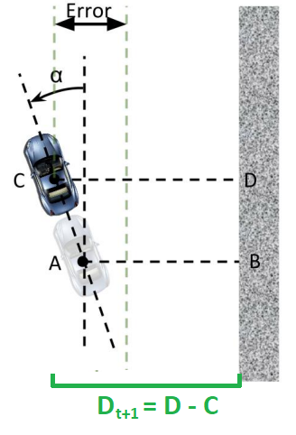

# Lab 3: Wall Following

## I. Learning Goals

- PID Controllers
- Driving the car autonomously via Wall Following

## II. Review of PID in the time domain

A PID controller is a way to maintain certain parameters of a system around a specified set point. PID controllers are used in a variety of applications requiring closed-loop control, such as in the VESC speed controller on your car.

The general equation for a PID controller in the time domain, as discussed in lecture, is as follows:

=K_{p}e(t)+K_{i}\int_{0}^{t}e(t^{\prime})dt^{\prime}+K_{d}\frac{d}{dt}(e(t)) )

Here, , , and  are constants that determine how much weight each of the three components (proportional, integral, derivative) contribute to the control output ). ) in our case is the steering angle we want the car to drive at. The error term ) is the difference between the set point and the parameter we want to maintain around that set point.

## III. Wall Following

In the context of our car, the desired distance to the wall should be our set point for our controller, which means our error is the difference between the desired and actual distance to the wall. This raises an important question: how do we measure the distance to the wall, and at what point in time? One option would simply be to consider the distance to the right wall at the current time  (let's call it ). Let's consider a generic orientation of the car with respect to the right wall and suppose the angle between the car's x-axis and the axis in the direction along the wall is denoted by . We will obtain two laser scans (distances) to the wall:
one 90 degrees to the right of the car's x-axis (beam b in the figure), and one (beam a) at an angle  (  degrees) to the first beam. Suppose these two laser scans return distances a and b, respectively.

*Figure 1: Distance and orientation of the car relative to the wall*

Using the two distances  and  from the laser scan, the angle  between the laser scans, and some trigonometry, we can express  as

-b}{a\mbox{sin}(\theta)}\right))

We can then express  as 

)

to get the current distance between the car and the right wall. What's our error term ), then? It's simply the difference between the desired distance and actual distance! For example, if our desired distance is 1 meter from the wall, then ) becomes .
	
However, we have a problem on our hands. Remember that this is a race: your car will be traveling at a high speed and therefore will have a non-instantaneous response to whatever speed and servo control you give to it. If we simply use the current distance to the wall, we might end up turning too late, and the car may crash. Therefore, we must look to the future and project the car ahead by a certain lookahead distance (let's call it ). Our new distance  will then be

)

*Figure 2: Finding the future distance from the car to the wall*

We're almost there. Our control algorithm gives us a steering angle for the VESC, but we would also like to slow the car down around corners for safety. We can compute the speed in a step-like fashion based on the steering angle, or equivalently the calculated error, so that as the angle exceeds progressively larger amounts, the speed is cut in discrete increments. For this lab, a good starting point for the speed control algorithm is:

- If the steering angle is between 0 degrees and 10 degrees, the car should drive at 1.5 meters per second.
- If the steering angle is between 10 degrees and 20 degrees, the speed should be 1.0 meters per second.
- Otherwise, the speed should be 0.5 meters per second.

So, in summary, here's what we need to do:

1. Obtain two laser scans (distances) a and b.
2. Use the distances a and b to calculate the angle  between the car's -axis and the right wall.
3. Use  to find the current distance  to the car, and then  and  to find the estimated future distance  to the wall.
4. Run  through the PID algorithm described above to get a steering angle.
5. Use the steering angle you computed in the previous step to compute a safe driving speed.
6. Publish the steering angle and driving speed to the `/drive` topic in simulation.

## IV. Implementation

Implement wall following to make the car drive autonomously around the Levine Hall map. Follow the inner walls of Levine. Which means follow left if the car is going counter-clockwise in the loop. (The first race we run will be counter-clockwise). You can implement this node in either C++ or Python.

## V. Deliverables and Submission

**Deliverable 1**: After you're finished, update the entire skeleton package directory with your `wall_follow` package and directly commit and push to the repo Github classroom created for you. Your commited code should start and run in simulation smoothly.

**Deliverable 2**: Make a screen cast of running your wall following node in the simulation. Include a link to the video on YouTube in **`SUBMISSION.md`**.

## VI: Grading Rubric

- Compilation: **10** Points
- Implemented PID: **40** Points
- Tuned PID: **40** Points
- Video: **10** Points
